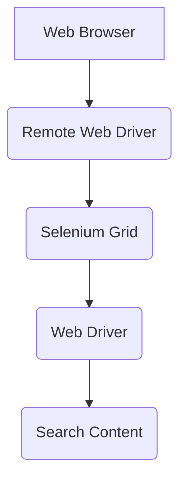

# selenium-docker e2e Framework

[](https://percy.io/)
[](https://maven-badges.herokuapp.com/maven-central/cz.jirutka.rsql/rsql-parser)

This is the Markdown file in **selenium-docker e2e Framework**. Reading the _markdown_ file will help to get an idea about the framework.

## Architecture

selenium-docker e2e Framework has been developed using Selenium which is traditional and mostly using automation tool which mostly used for Web Based applications along with Cucumber for the BDD implementation. 


## Create files and folders

In the Project source code under the directory of features (src/test/java/com/automation/seleniumdocker/features), 
will be used to store the feature files and under stepDefinitions (src/test/java/com/automation/seleniumdocker/stepDefinition),
the page objects will be stored in pageObjects (src/test/java/com/automation/seleniumdocker/pageObjects) folders.

### Usage

Sample **.feature** file
```gherkin
Feature: As a application user I should be validate in the login page

  Background:
    Given I am on app login page

  @all @regression
Scenario Outline: As a user I should not be able to login using invalid email address
  When I enter the username "<username>" on username field
  And I click on next button
  And I enter the password "<password>" on password field
  And I click on login button
  Then I should see "<validation>" validation message

  Examples:
  |username|password|validation|
  |shenali@eyepax.com|532733|Authentication failed, please try again.|
  |shenali.t@eyepax.com|bjsd|Authentication failed, please try again.|
```

Sample **Step Definition** File
```java
public class LoginStepDefinition extends BaseClass {
    private final WebDriver driver = initWebDriver();
    private final LoginPageObject loginPageObject = new LoginPageObject();
    private Percy percy;

    public LoginStepDefinition() throws IOException, DriverTypeUndefinedException {
    }

    @Given("I am on app login page")
    public void i_am_on_app_login_page() throws IOException {
        AppConfigReader appConfigReader = new AppConfigReader();
        assert driver != null;
        driver.get(appConfigReader.getURL());
        percy = new Percy(driver);
        percy.snapshot("Login Page - Username");
    }

    @Given("I can see the login prompt header")
    public void i_can_see_the_login_prompt_header() {
        loginPageObject.getLoginHeaderText("Login");
    }

    @When("I enter the username {string} on username field")
    public void i_enter_the_username_on_username_field(String username) {
        loginPageObject.setUsernameTxt(username);
    }

    @When("I click on next button")
    public void i_click_on_next_button() {
        loginPageObject.next();
    }

    @When("I enter the password {string} on password field")
    public void i_enter_the_password_on_password_field(String password){
        percy.snapshot("Login Page - Password");
        loginPageObject.setPasswordTxt(password);
    }
    @When("I click on login button")
    public void i_click_on_login_button(){
        loginPageObject.login();
    }
    @Then("I should get navigated to Home screen and see email {string}")
    public void i_should_get_navigated_to_home_screen(String header){
        percy.snapshot("Home Page");
        loginPageObject.validateUser(header);
    }
    @When("I choose language and system")
    public void i_choose_system(){
        percy.snapshot("Choose System Screen");
        loginPageObject.chooseSystem();
    }
    @When("I should see {string} validation message")
    public void i_should_see_validation_message(String msg){
        percy.snapshot("Login Validation");
        loginPageObject.errorValidation(msg);
    }
    @Given("I logged into app application as {string} and {string}")
    public void i_logged_into_app(String username, String password){
        loginPageObject.setUsernameTxt(username)
                .next()
                .setPasswordTxt(password)
                .login()
                .chooseSystem();
    }
}
```
Sample **Page Object** class
```java
public class LoginPageObject {
    /*
    * Constructor and Initiating the Page Factory
    * */
    public LoginPageObject(){
        PageFactory.initElements(ObjectRepository.driver,this);
    }
    /*
    * Element Locators
    * */
    @FindBy(xpath = "//div[@class='prm-login-form-wrap']/div/h4")
    private WebElement loginHeaderTxt;
    @FindBy(xpath = "//input[@id='username']")
    private WebElement usernameTxtFld;
    @FindBy(xpath = "//input[@type='submit']")
    private WebElement nextBtn;
    @FindBy(xpath = "//input[@id='password']")
    private WebElement passwordTxtFld;
    @FindBy(xpath = "//button[@type='submit']")
    private WebElement loginBtn;
    @FindBy(partialLinkText = "LMS")
    private WebElement systemLinkTxt;
    @FindBy(partialLinkText = "EN")
    private WebElement languageTxt;
    @FindBy(xpath = "//h3[@class='dashhead-title']")
    private WebElement loginIdentifier;
    @FindBy(xpath = "//span[@class='prm-err']")
    private WebElement errorMsgTxt;


    /*
    * Page methods
    * */
    public void getLoginHeaderText(String text){
        GenericHelper.waitUntilElementToBeVisible(loginHeaderTxt);
        Assert.assertEquals(text,loginHeaderTxt.getText());
    }
    public LoginPageObject setUsernameTxt(String username){
        GenericHelper.waitUntilElementToBeVisible(usernameTxtFld);
        this.usernameTxtFld.sendKeys(username);
        return this;
    }
    public LoginPageObject next(){
        GenericHelper.waitUntilElementToBeVisible(nextBtn);
        this.nextBtn.click();
        return this;
    }
    public LoginPageObject setPasswordTxt(String password){
        GenericHelper.waitUntilElementToBeVisible(passwordTxtFld);
        this.passwordTxtFld.sendKeys(password);
        return this;
    }
    public LoginPageObject login(){
        GenericHelper.waitUntilElementToBeVisible(loginBtn);
        this.loginBtn.click();
        return this;
    }
    public LoginPageObject chooseSystem(){
        GenericHelper.waitUntilElementToBeVisible(languageTxt);
        this.languageTxt.click();
        this.systemLinkTxt.click();
        return this;
    }
    public void validateUser(String header){
        GenericHelper.waitUntilElementToBeVisible(loginIdentifier);
        Assert.assertEquals(header, loginIdentifier.getText());
    }
    public void errorValidation(String msg){
        GenericHelper.waitUntilElementToBeVisible(errorMsgTxt);
        Assert.assertEquals(msg, errorMsgTxt.getText());
    }
}
```
### Installation

Complete Selenium e2e Framework needs below tools
[Java Development Kit](https://www.oracle.com/java/technologies/javase/javase-jdk8-downloads.html) v1.8 or v1.7.
[Apache Maven](https://maven.apache.org/download.cgi) v3.6.3 or above.
[Node JS](https://nodejs.org/en/download/) v12.19.0 or above
[Docker](https://www.docker.com/products/docker-desktop) latest

Execute the test's.

```sh
$ cd paa
$ docker-compose up
$ runmvn.bat
```

#### To Verify the Visual regression results you have to login to percy dashboard. 
Browserstack credentials:
```text
Username : 
Password : 
```

### Plugins

Automation Framework is currently extended with the following plugins. 
Instructions on how to use them in your own application are linked below.

| Plugin | Documentation |
| ------ | ------ |
| Selenium | [selenium/documentation][PlDb] |
| Cucumber | [cucumber/documentation][PlGh] |
| JUnit | [JUnit/documentation][PlDh]|
| Docker | [docker/documentation][PlDc]|
| Percy | [percy/documentation][PlDw]|


## License
----
All Rights Received by Eranda Kodagoda.

   [PlDh]: <https://junit.org/junit5/docs/current/user-guide/>
   [PlGh]: <https://cucumber.io/docs/gherkin/reference/>
   [PlDb]: <https://www.selenium.dev/documentation/en/>
   [PlDc]: <https://docs.docker.com/>
   [PlDw]: <https://docs.percy.io/docs/getting-started>